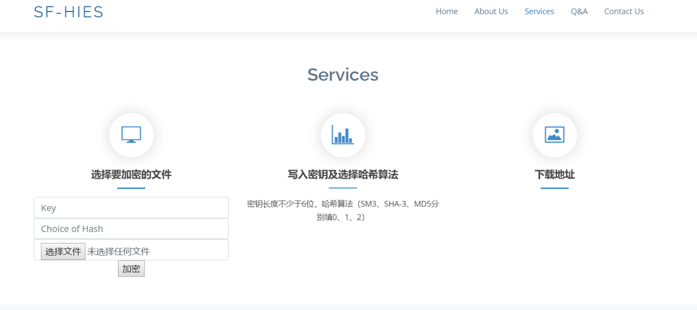

```
🕙 分享是一种美德，右上随手点个 🌟 Star，谢谢
```
 
**温馨提醒**
 
1. 本项目仅适用学习交流
2. 本项目不在任何平台出售,如有发现请积极举报<br/>

## 1 项目介绍
 
**基于FIDO2认证和OPAQUE协议的轻量级设备数据安全防护系统**
 
### 1.1 项目简介
本项目针对家庭数据盒子这一种典型的不具备安全芯片密钥管理条件的轻量级设备开发了基于FIDO2认证和OPAQUE协议的轻量级设备数据安全防护系统，旨在为物联网中的轻量级设备提供可靠的安全防护方案，保护用户的隐私和敏感信息，同时致力于在目前当前技术受限的环境下寻求创新的解决方案。<br/>
在当下5G技术与物联网飞速发展的时代，物联网有关的应用产品在将来将会快速地占据市场，进入到人们的生产生活中。其中，与人们生活息息相关的智慧家庭也将被人们广泛接受。相应地，其对低成本生产的需求也会逐渐增长。本项目提供的数据安全防护系统通过将FIDO2认证技术与OPAQUE协议结合，为不具备安全芯片等硬件防护条件的设备提供了一种崭新的数据加密、密钥管理形式，从而降低了相应设备对生产成本以及技术等的要求。本项目不仅仅可以应用于家庭存储盒子，相应地，其可以为有数据存储需求的个人以及企业的轻量级数据存储设备提供较为可靠的数据安全保护。<br/>
本方案采取的系统架构中的模块间耦合性较低，可以在将来使用更加安全可靠的身份认证技术等对本方案中的相应模块进行升级替换，以保证安全的可靠性、持久性。

### 1.2 功能介绍
（1）最快最短进行加密——缩短小型文件加密时间，保证小型文件加密效率<br/>
（2）增强加密算法复杂度及机密性——保证小型文件传输及存储安全性<br/>
（3）增强生成杂凑值的抗碰撞性及随机性——融入多种hash算法，国密SM3支撑加密强度<br/>
（4）防篡改防假冒——验证小型加密文件的完整性真实性<br/>
### 1.3 安装步骤
（1）安装依赖包
```
 pip install -r requirements.txt
```
 （2）启动项目
 ```
 python main.py  
```
（3）打开前端界面 <br/>
访问http://127.0.0.1:5000/<br/>

如图：
 

 
### 1.4 使用方法
（1）在前端界面导航栏点击services，导航到文件加密界面<br/>
如图：

（2）输入不少于6位的密钥，并选择哈希算法，选择需要加密的文件，点击加密，即可在下载地址找到下载已加密文件的url，将url复制到浏览器即可下载
