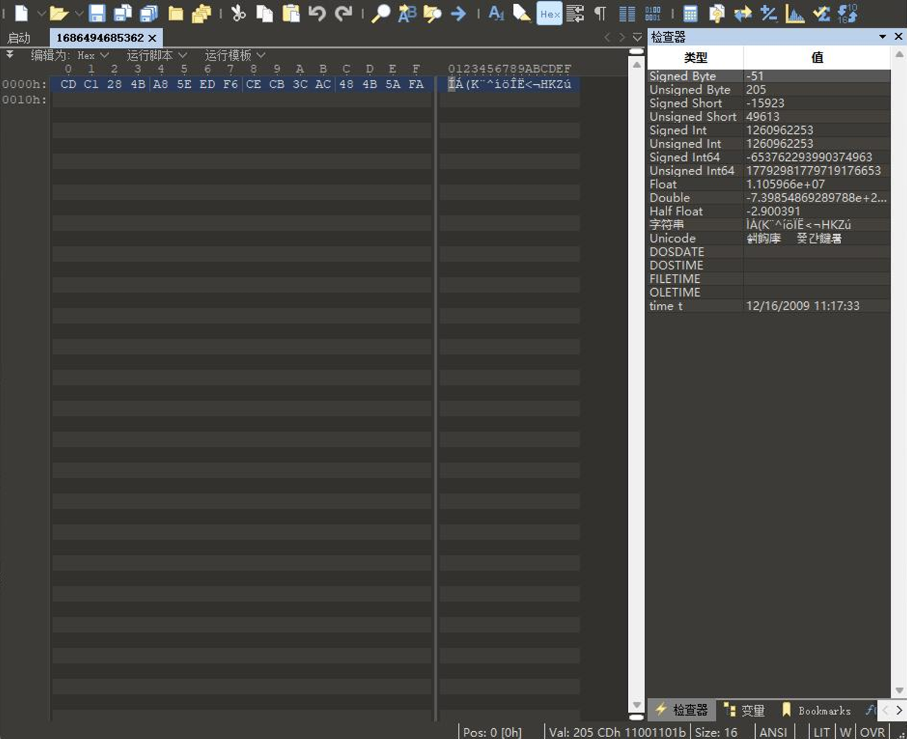

```
🕙 分享是一种美德，右上随手点个 🌟 Star，谢谢
```
 
**温馨提醒**
 
1. 本项目仅适用学习交流
2. 本项目不在任何平台出售,如有发现请积极举报<br/>

## 1 项目介绍
 
**基于FIDO2认证和OPAQUE协议的轻量级设备数据安全防护系统**
 
### 1.1 项目简介
本项目针对家庭数据盒子这一种典型的不具备安全芯片密钥管理条件的轻量级设备开发了基于FIDO2认证和OPAQUE协议的轻量级设备数据安全防护系统，旨在为物联网中的轻量级设备提供可靠的安全防护方案，保护用户的隐私和敏感信息，同时致力于在目前当前技术受限的环境下寻求创新的解决方案。<br/>
在当下5G技术与物联网飞速发展的时代，物联网有关的应用产品在将来将会快速地占据市场，进入到人们的生产生活中。其中，与人们生活息息相关的智慧家庭也将被人们广泛接受。相应地，其对低成本生产的需求也会逐渐增长。本项目提供的数据安全防护系统通过将FIDO2认证技术与OPAQUE协议结合，为不具备安全芯片等硬件防护条件的设备提供了一种崭新的数据加密、密钥管理形式，从而降低了相应设备对生产成本以及技术等的要求。本项目不仅仅可以应用于家庭存储盒子，相应地，其可以为有数据存储需求的个人以及企业的轻量级数据存储设备提供较为可靠的数据安全保护。<br/>
本方案采取的系统架构中的模块间耦合性较低，可以在将来使用更加安全可靠的身份认证技术等对本方案中的相应模块进行升级替换，以保证安全的可靠性、持久性。

### 1.2 安装步骤
（1）安装marven依赖
| 依赖   | 提供方 | 版本   |
|:--------:|:--------:|:--------:|
|mybatis   |  org.mybatis   | 3.5.8   |
| mysql-connector-java| mysql| 5.1.46|
| javax.servlet-api| javax.servlet| 3.1.0|
| jackson-core |com.fasterxml.jackson.core| 2.15.0-rc2|
| jackson-databind| com.fasterxml.jackson.core |2.15.0-rc2|
| jackson-annotations| com.fasterxml.jackson.core| 2.15.0-rc2|
| jackson-dataformat-cbor| com.fasterxml.jackson.dataformat| 2.15.0-rc2|
| jackson-datatype-jdk8| com.fasterxml.jackson.datatype| 2.15.0-rc2|
| fastjson2| com.alibaba.fastjson2| 2.0.25|
| webauthn-server-core| com.yubico| 2.4.0|
|slf4j-api| org.slf4j |1.7.36|
| logback-core| ch.qos.logback| 1.2.9|
| logback-classic| ch.qos.logback| 1.2.9|
| commons-email| org.apache.commons| 1.5|
| commons-fileupload |commons-fileupload| 1.5|
| commons-io| commons-io| 2.11.0|
| hutool-all| cn.hutool| 5.8.11|
| bcprov-jdk18on| org.bouncycastle| 1.72|

 （2）运行OpaqueServer.java文件<br/>
（3）使用maven的tomcat插件中的run功能启动项目<br/>
 （4）访问localhost:80<br/>


如图：<br/>
 

 
### 1.3 使用方法
（1）注册功能<br/>
启动项目后，在注册栏中输入邮箱并获取验证码。在注册栏中输入对应的验证码并进行注册。<br/>

<br/>

在WindowsHello设置界面输入PIN码或其他WindowsHello验证机制完成注册。<br/>

<br/>

（2）登录功能<br/>
启动项目后，在登录栏输入已经注册的账号并点击登录。<br/>

<br/>

在WindowsHello 界面使用注册时使用的验证机制进行登录。<br/>

<br/>

（3）文件上传功能<br/>
启动项目且登录后，在文件列表界面选择userA.txt文件。<br/>

<br/>

点击以上传文件。<br/>

<br/>

（4）文件加密存储功能<br/>
在该部分，我们会在客户端向服务端发送测试文件，在服务端直接查看该文件，模拟服务器遭到攻击导致文件泄露的情况。在进行文件上传功能的测试后，在服务端查看上传好的文件。<br/>
1686 开头的文件即为刚刚上传的userA.txt文件。使用记事本查看文件内容。<br/>

<br/>

无法查看文件的原本数据。<br/>
使用二进制编辑器010Editor查看文件内容。文件整体没有敏感信息如文件类型、大小泄露，文件头部也被隐藏，无法分析出文件格式及其中内容。<br/>

<br/>

（5）文件下载功能<br/>
启动项目后，登录并上传文件，此时文件列表效果如下图所示。<br/>

<br/>

点击下载按钮进行文件下载。<br/>

<br/>

（6）文件删除功能<br/>
启动项目后，登录并上传文件，此时文件列表效果如下图所示。<br/>

<br/>

点击删除按钮进行文件删除。<br/>

<br/>

（7）文件权限隔离功能<br/>
创建两个文本文件userA.txt与userB.txt，其中的内容如下图所示。<br/>

<br/>

分别使用两个账户114****405@qq.com与231****254@qq.com 注册并上传两个文件，此时两个账户各自的文件列表如下图所示。<br/>

<br/>

<br/>

两个用户退出登录后重新登录，文件列表中仍然只有各自的文件，无法越过权限控制获取对方的文件。<br/>
